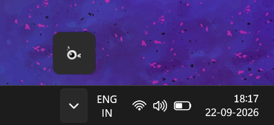
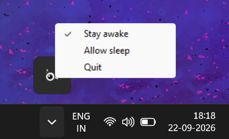

# Wink

  

A tiny Windows system-tray utility that keeps your computer awake and prevents
the display from turning off.

## Tray menu

- **Stay awake:** prevents system sleep and display timeout.
- **Allow sleep:** restores normal Windows power behavior.
- **Quit:** removes the tray icon and exits.

## Screenshots

## Contributing

See [CONTRIBUTING.md](CONTRIBUTING.md).

## License

Wink is licensed under the [MIT License](LICENSE).
